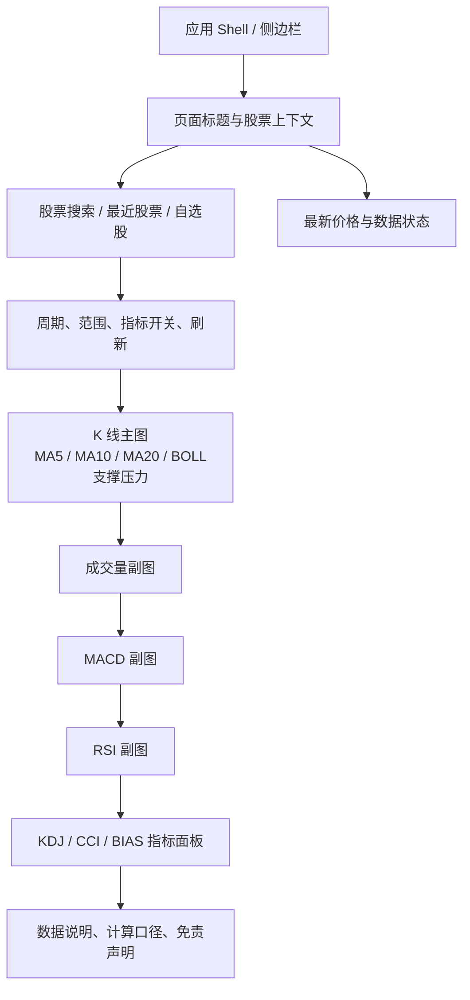

# 技术图表页面结构设计

## 1. 设计定位

技术图表页面是一个独立的行情分析工作台，承载 K 线、均线、成交量、MACD、RSI 和支撑压力等信息。页面通过侧边栏一级入口访问，也可以从首页、选股页、持仓页跳转进入。

页面结构遵循两个原则：

1. 股票上下文始终清晰，用户知道当前查看的股票、市场、周期和数据日期。
2. 主图和副图共享时间轴，指标通过开关控制，移动端不强制同时展示所有面板。

## 2. 页面骨架



推荐页面从上到下分为：

1. 页面标题区。
2. 股票选择和当前行情摘要区。
3. 图表控制工具栏。
4. K 线主图。
5. 成交量、MACD、RSI、KDJ、CCI、BIAS 副图或切换面板。
6. 数据状态和技术指标说明区。

## 3. 页面区域详细设计

### 3.1 页面标题区

左侧显示：

- 页面标题：技术图表。
- 页面说明：查看股票价格趋势、技术指标和量价关系。

右侧可放置：

- 回到首页分析。
- 刷新数据。
- 页面帮助或指标说明入口。

标题区不展示确定性买卖结论，避免让图表页面承担交易建议职责。

### 3.2 股票上下文区

建议采用“搜索框 + 当前股票卡片”的组合：

```text
┌──────────────────────────────────────────────────────────────┐
│ 股票搜索 [600519 / 贵州茅台                         ] [查询] │
│ 贵州茅台  600519.SH       最新价 --    涨跌 --    数据日期 -- │
│ 最近查看：平安银行  AAPL       自选股：宁德时代  腾讯控股      │
└──────────────────────────────────────────────────────────────┘
```

要求：

- 无 `stock` 查询参数时，搜索框是首要操作入口。
- 支持股票代码和名称搜索，最终传给 API 的必须是标准化股票代码。
- 从首页、选股或持仓跳转时自动填充股票，不要求用户二次输入。
- 最近查看和自选股属于快捷入口，不在本页面复制一套用户数据管理逻辑。
- 当前股票为空时，图表区域显示空状态，不发送无效 API 请求。

### 3.3 行情摘要区

当前股票选定后显示轻量摘要卡片：

| 卡片 | 内容 |
| --- | --- |
| 最新价 | 最新收盘价或实时价，并标示数据时间 |
| 涨跌 | 涨跌额、涨跌幅 |
| 数据范围 | 起止日期、数据点数量 |
| 当前趋势 | 仅显示“数据状态”或已定义的客观标签，不输出确定性建议 |

如果实时行情接口不可用，摘要可以降级为最新历史收盘价，但必须标识“历史收盘”。

### 3.4 图表控制工具栏

建议布局：

```text
周期 [日线]     范围 [60] [120] [250]
指标 [MA ✓] [BOLL ✓] [成交量 ✓] [MACD ✓] [RSI ✓] [KDJ] [CCI] [BIAS] [支撑压力 ✓]
```

PC / Mac 默认开启：`ma,boll,volume,macd,rsi,support_resistance`。KDJ / CCI / BIAS 默认关闭但可切换。开关与 `indicators` 查询参数双向同步。

第一版交互规则：

- 日线是默认且首个可用周期。
- 在后端周线/月线尚未实现前，周线/月线不应伪装成可用；可以隐藏，或显示为“即将支持”并禁用。
- 时间范围不能超过后端实际允许的最大值。
- 指标开关只控制展示和 API 请求字段，不改变股票或周期上下文。
- 页面状态变化应同步到 URL，支持刷新、复制链接和浏览器前进/后退。

### 3.5 K 线主图区

主图从上到下建议包含：

- K 线蜡烛图：开盘、最高、最低、收盘。
- MA5、MA10、MA20 叠加线。
- BOLL 上轨、中轨、下轨叠加线；带宽和价格位置在 tooltip 或图例中展示。
- 支撑位和压力位水平线。
- 近期高点和近期低点标记。
- 十字光标、日期同步和 tooltip。

主图顶部可显示当前光标日期的指标图例，例如：

```text
2026-07-13  O 1000.00  H 1015.00  L 995.00  C 1010.00
MA5 1002.00  MA10 998.00  MA20 990.00
```

### 3.6 副图区域

副图建议固定共享时间轴，面板可以按开关折叠：

1. 成交量：成交量柱、涨跌颜色；量比和放量/缩量放入 tooltip 或图例。
2. MACD：DIF、DEA、柱状图和零轴。
3. RSI：RSI6、RSI12、RSI24、30/70 参考线。
4. KDJ：K、D、J 和 20/80 参考线。
5. CCI：CCI 值、+100/-100 参考线。
6. BIAS：BIAS5、BIAS10、BIAS20。

移动端默认可以只展示主图、成交量和一个副图，KDJ、CCI、BIAS 通过切换器显示；PC / Mac 默认展示全部核心面板或允许用户折叠面板。所有指标都必须实现，折叠只影响默认布局，不影响能力。

**04d 实现（2026-07-14）**

- 断点：`(max-width: 1023px)`，与 Shell `lg` 对齐。
- 移动默认 indicators：`ma,boll,volume,macd,support_resistance`（无 URL 时 seed）。
- MACD/RSI/KDJ/CCI/BIAS 在窄屏为单选副图（`enforceSingleSubplot`）；工具栏可横滚。
- 紧凑 tooltip 底部定位；图表提供 `accessibleSummary` 与 `data-notes` 文本摘要。

### 3.7 数据说明区

页面底部显示：

- 数据来源和最近更新时间。
- 当前周期、返回点数和指标计算版本。
- 指标参数：MA5/10/20、MACD 12/26/9、RSI6/12/24。
- “技术指标仅供信息参考，不构成投资建议”的提示。
- 数据不足、缓存数据或数据源降级时的状态说明。

## 4. 路由状态设计

推荐路由：

```text
/technical-chart?stock=600519&period=daily&days=120&indicators=ma,volume,macd,rsi
```

前端状态分为三类：

| 状态 | 来源 | 是否写入 URL |
| --- | --- | --- |
| 股票代码、周期、范围 | 路由查询参数 | 是 |
| 指标开关 | 查询参数或页面默认值 | 建议是 |
| loading、error、empty | 请求运行态 | 否 |

页面初次加载时按以下优先级确定股票：

1. URL 中的 `stock`。
2. 从其他页面传入的标准化股票上下文。
3. 最近查看股票。
4. 当前用户自选股的第一只股票。
5. 无股票空状态。

如果页面直接刷新，必须能仅凭 URL 恢复股票、周期和时间范围。

## 5. 响应式布局

### PC / Mac

- 内容区采用单列宽图表，充分利用横向空间。
- 主图建议高度 420～520px，副图每个 150～220px。
- 工具栏可横向排列，指标开关直接显示。
- 允许同时展开所有第一版面板。

### 手机

- 股票搜索和工具栏允许换行或横向滚动。
- 主图保留足够的横向可缩放空间，不强行压缩为不可读的窄图。
- 副图支持折叠或单选切换，避免页面过长。
- tooltip 采用底部浮层或紧凑卡片，避免遮挡主要 K 线。
- 侧边栏点击导航后自动关闭抽屉。

## 6. 组件建议

建议页面由以下职责组成，具体文件名可按现有前端规范调整：

```text
TechnicalChartPage
├── TechnicalChartHeader
│   ├── StockSearchBox
│   └── StockContextSummary
├── TechnicalChartToolbar
├── TechnicalChartStateBlock
├── TechnicalChart
│   ├── PriceChartPanel
│   ├── VolumeChartPanel
│   ├── MacdChartPanel
│   ├── RsiChartPanel
│   ├── KdjChartPanel
│   ├── CciChartPanel
│   └── BiasChartPanel
└── TechnicalChartDataNotes
```

建议将 API 请求和 URL 状态管理放在页面容器，将图表渲染做成可复用组件，使历史趋势抽屉后续可以复用主图或摘要版本。

### 6.1 图表库选型（04b 冻结）

| 项 | 决定 |
| --- | --- |
| 库 | Apache ECharts（`echarts`，Apache-2.0），自 04b 引入 |
| 版本记录 | 以 `apps/dsa-web/package.json` 为准（首版接入 `6.1.0`） |
| 封装 | 不使用 `echarts-for-react`；自研 `EChartsHost` + `buildTechnicalChartOption` |
| 拆包 | `vite` manual chunk：`vendor-echarts`（含 `echarts` / `zrender`）；首版构建 gzip ≈ 203.5 kB |
| 加载 | 仅 lazy `TechnicalChartPage` 路由拉取，不进入 `App` / `Shell` / 首页静态依赖 |
| 现状目录 | `apps/dsa-web/src/components/technical-chart/` |
| Recharts | 继续服务持仓、AI 建议等既有页面，不在本阶段迁移 |

## 7. 页面数据依赖

页面至少需要以下后端能力：

| 能力 | 页面用途 | 当前情况 |
| --- | --- | --- |
| 股票标准化 / 搜索 | 股票上下文选择 | 已有部分能力，需确认复用入口 |
| 历史 OHLCV | K 线和成交量 | 已有日线基础接口 |
| 技术指标序列 | MA、MACD、RSI、BOLL、KDJ、CCI、BIAS 等曲线 | 当前缺少独立 API |
| 支撑压力摘要 | 主图水平线和标记 | 当前仅报告分析结果级字段，未形成图表契约 |
| 周线/月线 | 周期切换 | 服务层当前实际只支持 daily |
| 数据状态 | loading、无数据、数据源失败 | 当前历史服务将异常降级为空数组，需补充错误语义 |
| 计算版本 | 页面说明和缓存失效 | 当前历史接口没有该字段 |

完整后端差距见[技术图表后端能力评估与补全计划](technical-chart-backend-gap-analysis.md)。

## 8. 页面验收清单

- [ ] 侧边栏能进入技术图表页面。
- [ ] 无股票时显示搜索和快捷入口空状态。
- [ ] URL 带股票代码时能恢复页面上下文。
- [ ] 日线 K 线、MA、成交量、MACD、RSI 和支撑压力能够联动。
- [ ] 数据加载、无数据、数据不足、接口失败均有明确状态。
- [ ] 周线/月线未实现时不会显示为已支持能力。
- [ ] PC / Mac / 手机布局可用。
- [ ] 中英文文案、主题颜色和辅助标签完整。
- [ ] 页面截图和前端构建结果可作为验收证据。
